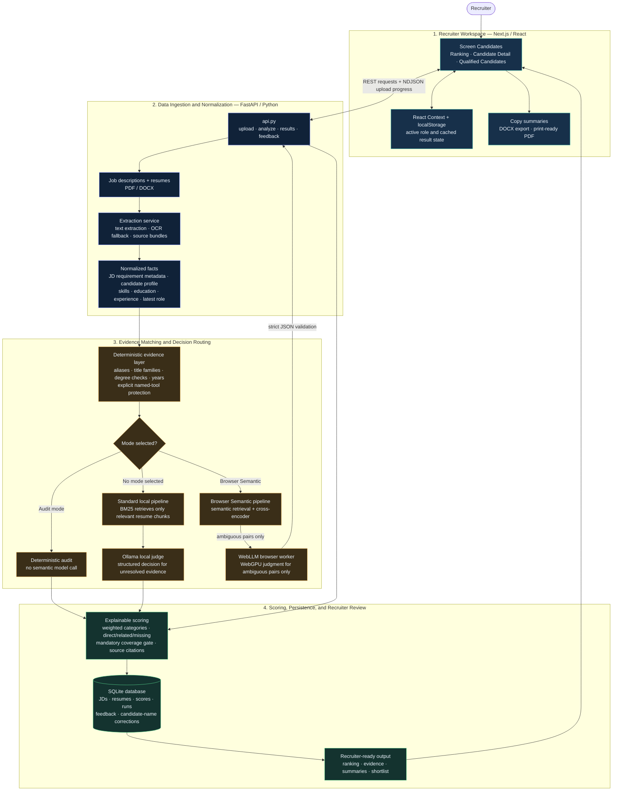

# VERA — Verified Evaluation & Ranking Assistant

VERA is a local-first, explainable resume-screening application. It accepts a job description (JD) and a batch of resumes, extracts structured facts, matches each candidate against the JD, and presents a traceable Job Fit score with the underlying evidence.

The application supports recruiter review, not replacement: a score is accompanied by direct matches, related/inferred evidence, missing requirements, and source citations where available.

## What VERA does

- Ingests **PDF** and **DOCX** job descriptions and resumes.
- Extracts candidate name, skills, work history, latest role, total experience, education, projects, and source-backed evidence.
- Builds stable, recruiter-adjustable JD requirement metadata.
- Scores candidates with deterministic rules and an optional semantic-evidence cascade.
- Keeps direct named-technology evidence separate from related capability evidence:
  - **Green** = explicit/direct evidence in the resume.
  - **Yellow** = related or inferred evidence; receives partial credit and should be verified in interview.
  - **Red** = no sufficient evidence found.
- Stores results, feedback, analysis runs, and candidate-name corrections locally in SQLite.
- Provides ranking, detailed evidence, candidate summaries, comparison, and a **Qualified Candidates** shortlist.
- Exports the shortlist as DOCX or print-ready PDF, and copies it to the clipboard.

## System architecture



**Decision boundary:** direct named skills must have explicit resume evidence. Semantic or broad-capability evidence can support a yellow/related result, but cannot turn an unmentioned named tool into a direct green match.

Candidate PII remains on the machine or infrastructure hosting VERA. Ollama runs locally; WebLLM runs in the end user’s browser. Neither mode requires a hosted third-party LLM API.

## The three operating modes

| UI selection | What happens | Model usage |
| --- | --- | --- |
| No mode selected | The standard local pipeline runs. Exact rules are attempted first; unresolved evidence can be judged by local Ollama. | Ollama may be called for non-exact evidence. |
| **Deterministic audit mode** | Uses source-backed parsing, aliases, title/education/experience rules, and deterministic matching only. | No semantic judge call. |
| **Browser semantic cascade** | The API performs deterministic checks, retrieval, and cross-encoder routing. Only remaining ambiguous candidate-requirement pairs are sent to the browser for a constrained WebLLM judgment. | WebLLM only for ambiguity; no Ollama semantic judging for those pairs. |

Browser semantic mode is intentionally not a broad “ask an LLM about the whole JD” operation. The backend creates one candidate-isolated semantic session, gives WebLLM a compact ambiguity batch, validates its structured response, and only then finalizes and persists the score.

## How matching and scoring work

### 1. Extract and normalize facts

`jd_extractor.py` parses role title, skills, experience, education, and preferred requirements from the JD. `extractor.py` parses resume sections and retains source markdown for auditable fallback checks. `skill_aliases.py`, `title_normalization.py`, and `education_matching.py` normalize common equivalents without inventing evidence.

### 2. Match requirements to evidence

For each candidate-JD pair, VERA attempts the strongest and cheapest evidence first:

1. Explicit resume text and approved aliases.
2. Deterministic facts: total years, education alternatives, and job-title families.
3. Capability-group rules that may yield **partial** related evidence, never a direct named-tool claim.
4. In the standard local flow, BM25 retrieval followed by an Ollama evidence judgment when needed.
5. In browser semantic mode, semantic retrieval and cross-encoder routing; WebLLM is requested only for unresolved ambiguity.

Named tools such as Prometheus, Grafana, Loki, ELK/OpenSearch, and OpenTelemetry require explicit product evidence. Broad concepts such as observability or monitoring cannot promote an unmentioned named product to a green/direct result.

### 3. Calculate Job Fit

The current weights in `vera-engine/scorer.py` total 100 points:

| Category | Weight | Rule |
| --- | ---: | --- |
| Mandatory skills | 30% | Direct and related evidence; gate uses confident mandatory coverage. |
| Relevant experience | 20% | Total extracted years compared with JD minimum, when specified. |
| Job title match | 10% | Latest extracted role compared with JD title family. |
| Role-specific requirements | 10% | Evidence-backed matching of the JD’s role-specific requirements. |
| Education | 25% | Verified degree/field against JD education requirements. |
| Preferred skills | 5% | Evidence-backed, non-gating preferred requirements. |

The current mandatory coverage threshold is **60%**. It is calculated as a proportion rather than a fixed count, so longer JDs are not unfairly stricter merely because they contain more requirements. A hard-gate failure remains visible in results and summaries.

## Project structure

```text
Resume-analyzer/
├── vera-engine/                 # Python/FastAPI scoring service
│   ├── api.py                   # HTTP endpoints, ingestion, run orchestration
│   ├── db.py                    # SQLite schema and persistence
│   ├── extractor.py             # Resume text extraction and structured facts
│   ├── jd_extractor.py          # JD extraction
│   ├── jd_policy.py             # Stable JD requirement metadata and overrides
│   ├── role_policies.py         # Recruiter-adjustable role-policy defaults
│   ├── scorer.py                # Local deterministic + Ollama scoring flow
│   ├── matcher.py, retrieval.py # BM25 evidence retrieval and matching
│   ├── judge.py                 # Local Ollama evidence judge
│   ├── semantic_pipeline.py     # Browser-semantic orchestration and scoring
│   ├── cross_encoder.py         # Semantic pre-routing before WebLLM
│   ├── webllm_contract.py       # Strict server-side judgment validation
│   ├── education_matching.py    # Verified education normalization/fallbacks
│   ├── job_title_matcher.py     # Title-family scoring and evidence
│   └── test_*.py                # Regression and contract tests
├── vera-frontend/               # Next.js 14 / React application
│   ├── app/screen/page.js       # JD/resume upload and pipeline controls
│   ├── app/results/[roleId]/    # Ranking and compare pages
│   ├── app/candidate/[candidateId]/ # Candidate evidence and recruiter decision
│   ├── app/shortlist/[roleId]/  # Qualified candidates and export page
│   ├── components/Sidebar.js    # Navigation
│   ├── lib/api.js               # FastAPI client
│   ├── lib/scoring.js           # Presentation summaries and score helpers
│   ├── lib/semanticRun.js       # Browser semantic-session handoff
│   ├── lib/webllm.js            # Lazy-loaded WebLLM browser integration
│   ├── lib/shortlistExport.js   # Client-side DOCX, PDF/print, clipboard exports
│   └── workers/webllm-worker.js # Isolated WebLLM worker
├── compose.yaml                 # Local Docker Compose environment
└── README.md
```

`jd_policy.py` and `role_policies.py` at the repository root are legacy duplicates. The active versions are inside `vera-engine/`; only those should be changed or staged for the application.

## API overview

| Endpoint | Purpose |
| --- | --- |
| `POST /jds/upload` | Upload and extract a JD. |
| `GET /jds`, `GET /jds/{role_id}` | Browse/fetch saved JDs. |
| `PUT /jds/{role_id}/requirement-overrides` | Save recruiter requirement metadata changes. |
| `POST /resumes/upload` | Upload resumes; response streams NDJSON progress per file. |
| `PUT /candidates/{candidate_id}/name` | Persist an HR correction to the candidate name. |
| `POST /analyze` | Run standard local or deterministic-audit scoring. |
| `POST /semantic-sessions` | Start browser-semantic sessions. |
| `POST /semantic-sessions/{session_id}/webllm-judgments` | Submit validated browser judgments for a session. |
| `GET /results/{role_id}` | Get stored ranking and full evidence. |
| `GET /assessments/{role_id}/{candidate_id}` | Get a compact, review-oriented assessment. |
| `GET /runs`, `GET /runs/{run_id}` | Inspect tracked analysis-run status. |
| `GET/PUT /feedback/{role_id}/{candidate_id}` | Read or save recruiter feedback. |

## UI workflow

1. Open **Screen Candidates** and upload/select a JD.
2. Upload one or more resumes. Candidate names are extracted from resume text; the displayed name can be corrected and saved to the database.
3. Choose standard processing, **Deterministic audit mode**, or **Browser semantic cascade**.
4. Run analysis and monitor candidate-level progress.
5. Open **Candidate Ranking** for score and evidence-aware results.
6. Open **Candidate Detail** for every evaluated criterion, citations, summary, and recruiter decision.
7. Open **Qualified Candidates** to review candidates whose Job Fit is at least 65% **or** who pass the mandatory threshold. Copy all summaries, download DOCX, or create a PDF through the system print dialog.

## Local development

### Prerequisites

- Python 3.10+ (the project is also used with newer Python releases)
- Node.js 18+ and npm
- Optional but recommended for standard local semantic judging: [Ollama](https://ollama.com/)
- Optional for scanned PDFs: Tesseract OCR and Poppler
- Browser semantic mode: a browser with WebGPU support and adequate device memory

### Backend

```bash
cd vera-engine
python3 -m venv venv
source venv/bin/activate               # Windows: venv\Scripts\activate
pip install -r requirements.txt

# Required only for the standard local semantic judge.
ollama pull qwen2.5:3b
ollama pull gemma3:1b

uvicorn api:app --reload
```

The API starts at `http://localhost:8000`. It creates `VERA.db` and `storage/` locally. These are runtime data and should not be committed to Git.

### Frontend

```bash
cd vera-frontend
npm install
cp .env.local.example .env.local       # Windows PowerShell: Copy-Item .env.local.example .env.local
npm run dev
```

Open `http://localhost:3000`. Set `NEXT_PUBLIC_API_BASE_URL` in `.env.local` when the API is not running at `http://localhost:8000`.

### Verify the frontend

```bash
cd vera-frontend
npm run build
```

## Docker Compose

From the repository root:

```bash
docker compose up --build
```

The dashboard is available at `http://localhost:3000` and the API at `http://localhost:8000`. Compose persists SQLite data and uploaded documents in Docker volumes. Ollama runs outside the containers by default; Docker reaches it through `host.docker.internal`.

Stop services without deleting stored data:

```bash
docker compose down
```

## Environment variables

| Variable | Used by | Default | Purpose |
| --- | --- | --- | --- |
| `NEXT_PUBLIC_API_BASE_URL` | Frontend | `http://localhost:8000` | FastAPI base URL exposed to the browser. |
| `OLLAMA_HOST` | Backend/Ollama client | Ollama local default | Ollama server location. |
| `TALENTLENS_FRONTEND_ORIGINS` | Backend | `http://localhost:3000` | Comma-separated allowed frontend origins for CORS. |
| `TALENTLENS_DB_PATH` | Backend | `VERA.db` | SQLite database path. |
| `TALENTLENS_MAX_WORKERS` | Backend | `4` | Candidate-level I/O worker limit. |

## Version-control guidance

Commit source, tests, documentation, Docker files, and lockfiles. Do **not** commit runtime or private data:

- `vera-engine/venv/`, `__pycache__/`, `.pytest_cache/`
- `vera-frontend/node_modules/`, `.next/`
- `.env.local` and credentials
- SQLite files such as `VERA.db` / `VERA.test.db`
- uploaded resumes/JDs under `storage/`

<<<<<<< Updated upstream

## 📊 Scoring Methodology

The final Job Fit score (0-100%) is calculated across 7 weighted categories (configured in `scorer.py`):

1. **Mandatory Skills (25%)**: Must clear the minimum contribution threshold. Evaluated via exact word-boundary match or BM25+LLM evidence.
2. **Relevant Experience (25%)**: Deterministic calculation of total years worked vs. JD minimum requirements.
3. **Education (20%)**: Degree and field matching against JD requirements.
4. **Industry Keywords (10%)**: Domain-specific terminology matches (e.g., "Fintech", "Healthcare").
5. **Soft Skills (10%)**: Interpersonal and workflow requirements.
6. **Job Title Match (5%)**: Deterministic similarity bypass (>= 50% match) or LLM evaluation of the candidate's recent roles against the target role.
7. **Preferred Skills (5%)**: "Nice-to-have" technical tools and frameworks.

**The Hard Gate:** By default, if a candidate is missing more than **6** Mandatory Skills, their application is flagged as `hard_gate_failed`, excluding them from the primary ranked pool.
=======
## Limitations and recruiter guidance

Resume parsing is affected by document layout and OCR quality. Yellow inferred evidence is not proof of hands-on experience; use it as an interview prompt. A high score indicates alignment with the parsed JD and extracted evidence, not a hiring recommendation. Always review the evidence and make the final decision using relevant human criteria.
>>>>>>> Stashed changes
